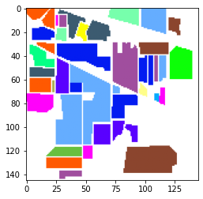
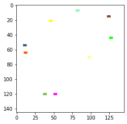

# Indian Pine datasets

高分光センサーを搭載した航空画像AVIRISで撮影した IndianPine Site3 の[データセット]をscikit-learnで読めるようにした．

[データセット]:https://purr.purdue.edu/publications/1947/1

## module install

```{shell}
pip install git+https://github.com/helmenov/IndianPines
```

## provides

- *Readme.md* : この文書
- *setup.py* : pipで導入するために必要なスクリプト
- *dataset.py* : 主メソッド"*load_IndianPine*"（だけ）が入っているスクリプト．
- *make_datasets.py* : データセット提供元（Purdue大学）からダウンロードしてきた巨大なzipファイルから，CSVファイルを作るスクリプト
- *example.py*: 使用例
- *data/*
  - *IndianPines.csv* : 作ったデータベースCSVファイル
  - *recategorize17to10.csv* : 元はクラス数16（＋ラベル無し1）のアノテーションがあるが，いくつかのクラスは極端にサイズが小さいので，いくつかのクラスをまとめてクラス数9（＋ラベル無し）にするとよい．そのための対応表．元は {BackGround,Alfalfa,Corn-notill,Corn-min,Corn,Grass/Pasture,Grass/Trees,Grass/pasture-mowed,Hay-windrowed,Oats,Soybeans-no
till,Soybeans-min,Soybean-clean,Wheat,Woods,Bldg-Grass-Tree-Drives,Stone-steel towers}, カテゴリ修正後は {BackGround,Alfalfa,Corn,Grass,Hay-windrowed,Soybeans,Wheat,Woods,Bldg-Grass-Tree-Drives,Stone-steel towers}. カテゴリ修正後のクラスに対する16進数形式のカラーマップも提供する．
- *descr/*
  - *IndianPines.rst* : データセットの説明

## ```import IndianPines```

```{python}
Bunch IndianPines.load(pca = 2, background = True, recategorize_rule = None, )
```

- Inputs
  - **pca** : 元は220次元の高分光情報で構成されるため，主成分分析で次元圧縮する．圧縮後の次元数（N>=1），または寄与率（0<N<1），元のまま（N=0）．
  - **background** : feature,targetなどにBackGroundクラスを含める．Falseで含めない（座標によってデータレコードが無くなる）
  - **recategorize_rule** : クラス番号のりカテゴライズルールを記したcsvファイル
- Outputs
  - Bunch形式（scikit-learn互換）
    - **.features** : 独立変数，説明変数，分光情報（または主成分）
    - **.target** ：従属変数，目的変数，カテゴリクラス
    - **.cordinates** ：座標情報
    - **.feature_names**：各説明変数の名前
    - **.target_names**：目的変数のカテゴリクラスの名前
    - **.cordinate_names**：座標情報の名前
    - **.hex_names**：目的変数のカテゴリクラスに対応する16進数カラー
    - **.DESCR**：データセットの説明
    - **.filename**：データセットのCSVファイル名

## IndianPines.make_datasets

提供元のデータセットZipファイルからCSVファイルを作成する

1. 提供元からデータセットをダウンロードして **src/10_4231_R7RX991C.zip** に保存する
2. ```{bash} python make_datasets.py```


## example

```python
import IndianPines as pines
from matplotlib import colors
from matplotlib import pyplot 
import pandas as pd
import numpy as np

pines.make_dataset()

conf = {
    "pca": 5,
    #"recategorize_rule": 'data/recategorize17to10.csv',
    "include_background":False,
}
IndianPines = pines.load(**conf)
```


```python
np.max(IndianPines.target)
```


    16


```python
cordinates_df = pd.DataFrame(IndianPines.cordinates, columns=IndianPines.cordinate_names)
features_df = pd.DataFrame(IndianPines.features, columns=IndianPines.feature_names)
target_df = pd.DataFrame(IndianPines.target_names[IndianPines.target],columns=['category'])
hex_df = pd.DataFrame(IndianPines.hex_names[IndianPines.target],columns=['hex-color'])
data_df = pd.concat([cordinates_df,features_df,target_df,hex_df],axis=1)
data_df = data_df.set_index(['column#','row#'])
data_df.info()
```

    <class 'pandas.core.frame.DataFrame'>
    MultiIndex: 10366 entries, (0, 0) to (143, 32)
    Data columns (total 7 columns):
     #   Column     Non-Null Count  Dtype  
    ---  ------     --------------  -----  
     0   PC1        10366 non-null  float64
     1   PC2        10366 non-null  float64
     2   PC3        10366 non-null  float64
     3   PC4        10366 non-null  float64
     4   PC5        10366 non-null  float64
     5   category   10366 non-null  object 
     6   hex-color  10366 non-null  object 
    dtypes: float64(5), object(2)
    memory usage: 617.8+ KB


```python
# Variable 'PC2'  of  head 5 samples
display(data_df['PC2'].head(10))
```


    column#  row#
    0        0       0.568190
             1      -0.644221
             2      -1.011396
             3      -0.764560
             4       0.154656
             5       1.420347
             6       2.019141
             7       1.283642
             8       0.505570
             9       0.684659
    Name: PC2, dtype: float64


```python
# datas of  sample cordicates(10,30) 
display(data_df.loc[(10,30)])
```


    PC1                 0.891344
    PC2                 1.884929
    PC3                -1.265276
    PC4                -0.561144
    PC5                -0.261861
    category     Soybeans-notill
    hex-color            #a04e9e
    Name: (10, 30), dtype: object


```python
#display(pd.DataFrame(target_df['category'].value_counts()))
display(pd.DataFrame(target_df['category'].value_counts().sort_index()))
```


<div>
<style scoped>
    .dataframe tbody tr th:only-of-type {
        vertical-align: middle;
    }

    .dataframe tbody tr th {
        vertical-align: top;
    }

    .dataframe thead th {
        text-align: right;
    }
</style>
<table border="1" class="dataframe">
  <thead>
    <tr style="text-align: right;">
      <th></th>
      <th>category</th>
    </tr>
  </thead>
  <tbody>
    <tr>
      <th>Alfalfa</th>
      <td>54</td>
    </tr>
    <tr>
      <th>Bldg-Grass-Tree-Drives</th>
      <td>380</td>
    </tr>
    <tr>
      <th>Corn</th>
      <td>234</td>
    </tr>
    <tr>
      <th>Corn-min</th>
      <td>834</td>
    </tr>
    <tr>
      <th>Corn-notill</th>
      <td>1434</td>
    </tr>
    <tr>
      <th>Grass/Pasture</th>
      <td>497</td>
    </tr>
    <tr>
      <th>Grass/Trees</th>
      <td>747</td>
    </tr>
    <tr>
      <th>Grass/pasture-mowed</th>
      <td>26</td>
    </tr>
    <tr>
      <th>Hay-windrowed</th>
      <td>489</td>
    </tr>
    <tr>
      <th>Oats</th>
      <td>20</td>
    </tr>
    <tr>
      <th>Soybean-clean</th>
      <td>614</td>
    </tr>
    <tr>
      <th>Soybeans-min</th>
      <td>2468</td>
    </tr>
    <tr>
      <th>Soybeans-notill</th>
      <td>968</td>
    </tr>
    <tr>
      <th>Stone-steel towers</th>
      <td>95</td>
    </tr>
    <tr>
      <th>Wheat</th>
      <td>212</td>
    </tr>
    <tr>
      <th>Woods</th>
      <td>1294</td>
    </tr>
  </tbody>
</table>
</div>


```python
if conf['include_background'] == False:
   new_cordinates = pd.DataFrame([(x, y) for x in range(0,145) for y in range(0,145)],columns=['column#','row#'])
   hex_old_cordinates = pd.concat([cordinates_df,hex_df],axis=1)
   cordinates_hex = pd.merge(new_cordinates, hex_old_cordinates,on=['column#','row#'],how='left')
   cordinates_hex = cordinates_hex.fillna('#ffffff')
   hex_df = cordinates_hex

pyplot.imshow(colors.to_rgba_array(hex_df['hex-color'].values).reshape([145,145,4]))
                                                                
```


    <matplotlib.image.AxesImage at 0x15f5dda80>


    

    


```python
Traininglist='data/TrainingSampleExample.csv'
trlist_df = pd.read_csv(Traininglist)
mapcordinates_df = pd.DataFrame([(x, y) for x in range(0,145) for y in range(0,145)],columns=['column#','row#'])
trlist_df = pd.concat([mapcordinates_df,trlist_df],axis=1)
trlist_df = trlist_df.set_index(['column#','row#'])
tr_df = pd.merge(data_df,trlist_df,on=['column#','row#'],how='left')

# sampled by tr05
trdata_df = tr_df.query('tr05>0') 

# incredients
display(pd.DataFrame(trdata_df['category'].value_counts()))

# map
tr_cordinates_hex = pd.merge(mapcordinates_df,trdata_df['hex-color'],on=['column#','row#'],how='left')
tr_cordinates_hex = tr_cordinates_hex.fillna('#ffffffff')
pyplot.imshow(colors.to_rgba_array(tr_cordinates_hex['hex-color'].values).reshape([145,145,4]))
```


<div>
<style scoped>
    .dataframe tbody tr th:only-of-type {
        vertical-align: middle;
    }

    .dataframe tbody tr th {
        vertical-align: top;
    }

    .dataframe thead th {
        text-align: right;
    }
</style>
<table border="1" class="dataframe">
  <thead>
    <tr style="text-align: right;">
      <th></th>
      <th>category</th>
    </tr>
  </thead>
  <tbody>
    <tr>
      <th>Bldg-Grass-Tree-Drives</th>
      <td>15</td>
    </tr>
    <tr>
      <th>Woods</th>
      <td>15</td>
    </tr>
    <tr>
      <th>Stone-steel towers</th>
      <td>15</td>
    </tr>
    <tr>
      <th>Hay-windrowed</th>
      <td>15</td>
    </tr>
    <tr>
      <th>Soybean-clean</th>
      <td>15</td>
    </tr>
    <tr>
      <th>Corn-min</th>
      <td>15</td>
    </tr>
    <tr>
      <th>Alfalfa</th>
      <td>15</td>
    </tr>
    <tr>
      <th>Wheat</th>
      <td>15</td>
    </tr>
    <tr>
      <th>Grass/Pasture</th>
      <td>15</td>
    </tr>
  </tbody>
</table>
</div>


    <matplotlib.image.AxesImage at 0x15f4ea1a0>


    

    

